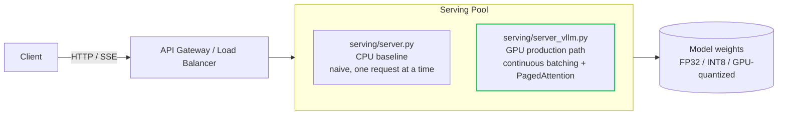

# Low-Latency LLM Serving Benchmark

A reference architecture and reproducible benchmark harness for low-latency
LLM/small-model serving: a CPU-runnable baseline server you can actually run
and load-test yourself, a real (and honestly counterintuitive) quantization
measurement, and a documented GPU/vLLM production path for when a single
naive server stops being enough.

This repo exists to show, with numbers you can reproduce on your own laptop,
*why* production LLM serving looks the way it does (continuous batching,
token streaming, careful quantization tradeoffs) rather than just asserting
it. See [docs/adr/](docs/adr/) for the reasoning behind each design choice,
and [docs/PRODUCTION.md](docs/PRODUCTION.md) for how this scales past one
CPU process.

## Architecture



`serving/server.py` (this repo's CPU baseline) and `serving/server_vllm.py`
(the documented GPU production path) expose the **same**
OpenAI-Chat-Completions-shaped `/v1/chat/completions` contract, so a client
never needs to know which one it's talking to.

## Why this matters: latency budgets and batching, explained gently

If you've only ever called a hosted LLM API, "latency" probably means one
number: how long until the response comes back. Once you're the one running
the server, it splits into several things that trade off against each other:

- **Time-to-first-token (TTFT)** — how long before the *first* piece of the
  answer appears. This is what makes a chat UI feel responsive, and it's why
  this server streams tokens over Server-Sent Events instead of waiting for
  the full reply (see [ADR 002](docs/adr/002-sse-streaming-over-request-response.md)).
- **Per-request total latency** — how long the *whole* answer takes. Users
  notice this less if TTFT is low and tokens keep arriving steadily, but it
  still matters for anything that needs the complete answer before acting on
  it.
- **Throughput** — how many requests per second the whole serving pool can
  sustain. This is where a naive "one request at a time" server falls apart
  under real concurrent traffic, which is exactly what this repo's own
  measurements below show.

**When NOT to reach for the production stack in this repo:** if you're
serving a handful of requests a minute, on a single node, with no strict
latency SLO, the CPU baseline here (or something equivalently simple) is
genuinely fine — don't stand up vLLM, custom autoscaling, and a Prometheus
pipeline for a workload that doesn't need it. The production path in
[docs/PRODUCTION.md](docs/PRODUCTION.md) earns its complexity at real
concurrent load; below that, it's just operational overhead.

## What's measured here, for real, on this build machine

All numbers below were produced by actually running the scripts in this
repo (`serving/quantize.py`, `bench/load_test.py`) against
`HuggingFaceTB/SmolLM2-135M-Instruct` on a CPU-only machine. They're a
baseline for understanding the *shape* of the problem — not a production SLA
for any real deployment, and not a substitute for measuring your own model
on your own hardware.

### Quantization: a real, slightly counterintuitive result

| | FP32 | Dynamic INT8 | Change |
|---|---|---|---|
| Model size (state_dict) | 513.2 MB | 236.6 MB | **-53.9%** |
| Median single-request latency (32 new tokens) | 2.050 s | 3.763 s | **+83.5% (slower)** |

Quantization *did* shrink the model roughly in half, as expected. It also
made single-request latency **worse**, not better, on this CPU — dynamic
INT8 quantization pays a fixed quantize/dequantize cost on every forward
pass, and at batch size 1 that overhead outweighs the compute savings on
this hardware's kernel. We kept this result exactly as measured instead of
picking a more flattering setup, because "quantization is a real tradeoff,
not a free win" is the actual lesson — see
[ADR 003](docs/adr/003-quantization-tradeoffs.md) for the full explanation
and where quantization *does* reliably pay off (GPU-native kernels like
AWQ/GPTQ, documented in [docs/PRODUCTION.md](docs/PRODUCTION.md)).

### Concurrency sweep: why naive serving doesn't scale

| Concurrency | p50 latency | p95 latency | Throughput |
|---|---|---|---|
| 1 | 1.546 s | 1.775 s | 0.658 req/s |
| 2 | 2.995 s | 3.357 s | 0.660 req/s |
| 4 | 6.001 s | 6.084 s | 0.662 req/s |
| 8 | 11.542 s | 11.544 s | 0.693 req/s |

Throughput is flat at ~0.66 req/s no matter how many concurrent requests you
throw at it, while p50 latency scales almost exactly linearly with
concurrency. That's the direct, measured fingerprint of "no batching": every
extra concurrent request just waits behind the ones ahead of it. This is
precisely the problem continuous batching (vLLM) solves — see
[ADR 001](docs/adr/001-continuous-batching-over-naive-serving.md) and the
cited external benchmark in [docs/PRODUCTION.md](docs/PRODUCTION.md).

## Repo layout

```
serving/
  model_registry.py  # loads/caches the local HF model (shared by server + quantize)
  server.py           # CPU baseline: FastAPI, SSE streaming, naive per-request generation
  server_vllm.py       # GPU production path: vLLM continuous batching (not runnable without a GPU)
  quantize.py          # real CPU dynamic INT8 quantization + before/after measurement
bench/
  load_test.py         # asyncio concurrency-sweep load generator (p50/p95/p99, throughput)
deploy/k8s/
  deployment.yaml, service.yaml, hpa.yaml
docs/
  PRODUCTION.md
  adr/                 # 3 architecture decision records
tests/                 # pytest, all passing against the real model
.github/workflows/ci.yml
```

## Setup & run

```bash
python -m venv .venv && source .venv/bin/activate   # or .venv\Scripts\activate on Windows
pip install -r requirements.txt

# Run the tests (loads the real ~135M-param model; fast, no GPU needed)
pytest tests/ -v

# Start the baseline server
uvicorn serving.server:app --host 0.0.0.0 --port 8000

# In another terminal: run the real quantization comparison
python -m serving.quantize

# ...and the real concurrency-sweep load test
python -m bench.load_test --base-url http://127.0.0.1:8000 \
    --concurrency 1 2 4 8 --requests-per-level 8 --max-tokens 24
```

Try a request yourself:

```bash
curl -N -X POST http://127.0.0.1:8000/v1/chat/completions \
  -H "Content-Type: application/json" \
  -d '{"messages":[{"role":"user","content":"What does a load balancer do?"}],"max_tokens":40}'
```

`-N` disables curl's output buffering so you can watch the SSE tokens arrive
one at a time.

## Production path

The CPU baseline above should never be deployed as-is. See
[docs/PRODUCTION.md](docs/PRODUCTION.md) for: swapping in vLLM's
continuous-batching engine, the cited external throughput benchmark, a
cost/latency tradeoff table for tuning batch size, the Kubernetes manifests
in `deploy/k8s/` explained line by line, autoscaling cooldown tuning for
bursty traffic, model warm-pool/cold-start mitigation, and a canary +
shadow-traffic rollout process for shipping a new serving image safely.

## License

MIT -- see [LICENSE](./LICENSE).

---


### Thank you for reading

#### Please consider giving a star if you find the repo useful. Thank you.

---

### **AUTHOR'S BACKGROUND**
### Author's Name:  Emmanuel Oyekanlu
```
Skillset:   I have experience spanning several years in data science, enterprise AI architecture and solutions, developing scalable enterprise data pipelines,
enterprise solution architecture, architecting enterprise systems data and AI applications,
software and AI solution design and deployments, data engineering, industrial intelligent vision systems, high performance computing (GPU, CUDA), machine learning,
NLP, Agentic-AI and LLM applications as well as deploying scalable solutions (apps) on-prem and in the cloud.

I can be reached through: manuelbomi@yahoo.com

Publications:  https://scholar.google.com/citations?user=S-jTMfkAAAAJ&hl=en
LinkedIn:  https://www.linkedin.com/in/emmanuel-oyekanlu-6ba98616
Github:  https://github.com/manuelbomi

```
[](https://skillicons.dev)
